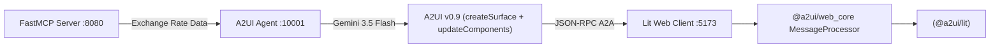

# A2UI (Agent-to-User Interface) - Official Specification v0.9

This directory contains a production-grade implementation of the **Agent-to-User Interface (A2UI) Protocol v0.9** within an A2A (Agent-to-Agent) ecosystem, powered by **Gemini 3.5 Flash** and Google's official **`@a2ui/lit`** and **`@a2ui/web_core`** libraries.

---

## 🚀 The A2UI Evolution: Prompt-First Architecture (v0.9)

In version **0.9**, the A2UI protocol evolved from legacy structured output into a **Prompt-First** model:
- **Prompt-First Philosophy**: In-context schema design optimized for LLM system instructions, reducing token overhead and eliminating fragile deep nesting.
- **Envelope Standardization**: Every message specifies `"version": "v0.9"`.
- **Decoupled State**: Dynamic state updates (`updateDataModel`) are separated from declarative UI layout (`updateComponents`).
- **Standard Catalogs**: Adheres to the official [Basic Catalog](https://a2ui.org/specification/v0_9/basic_catalog.json).

---

## 📨 Core Server-to-Client Messages

The agent streams an array of self-contained JSON messages:

```json
[
  {
    "version": "v0.9",
    "createSurface": {
      "surfaceId": "currency_view",
      "catalogId": "https://a2ui.org/specification/v0_9/basic_catalog.json"
    }
  },
  {
    "version": "v0.9",
    "updateDataModel": {
      "surfaceId": "currency_view",
      "path": "/",
      "value": {
        "base": "USD",
        "target": "MXN",
        "rate": 17.35,
        "amount": 100,
        "converted": 1735.00
      }
    }
  },
  {
    "version": "v0.9",
    "updateComponents": {
      "surfaceId": "currency_view",
      "components": [
        {
          "id": "root",
          "component": "Column",
          "children": ["header_text", "rate_card", "actions_row"]
        },
        {
          "id": "header_text",
          "component": "Text",
          "text": "Currency Conversion",
          "variant": "h1"
        },
        {
          "id": "rate_card",
          "component": "Card",
          "child": "card_content"
        },
        {
          "id": "card_content",
          "component": "Column",
          "children": ["rate_info", "rate_caption"]
        },
        {
          "id": "rate_info",
          "component": "Text",
          "text": "100 USD = 1,735.00 MXN",
          "variant": "h2"
        },
        {
          "id": "rate_caption",
          "component": "Text",
          "text": "Rate: 1 USD = 17.35 MXN (Live data via FastMCP)",
          "variant": "caption"
        },
        {
          "id": "actions_row",
          "component": "Row",
          "children": ["refresh_btn"]
        },
        {
          "id": "refresh_btn",
          "component": "Button",
          "child": "refresh_btn_text",
          "variant": "primary",
          "action": { "name": "refresh_rate" }
        },
        {
          "id": "refresh_btn_text",
          "component": "Text",
          "text": "Refresh Rate"
        }
      ]
    }
  }
]
```

---

## 🛠️ System Architecture



1. **MCP Server** (`../MCP/server.py`): Serves live exchange rates via FastMCP over HTTP SSE.
2. **AI Agent** (`agent.py`):
   - Fetches rates via `MCPToolset`.
   - Formulates responses adhering to A2UI v0.9 Prompt-First instructions.
   - Streams text and UI payload delimited by `---a2ui_JSON---`.
   - Exposes A2A JSON-RPC endpoint on port `10001` with CORS enabled.
3. **Lit Web Client** (`client-lit/`):
   - Integrated with Google's official `@a2ui/lit` and `@a2ui/web_core` 0.9 libraries.
   - Dispatches user actions (such as `"refresh_rate"`) back to the agent.
4. **Simulator & Verifier**:
   - `test_client.py`: Python CLI tool to inspect the generated tree in the terminal.
   - `../verify.py`: Diagnostic suite checking v0.9 compliance.

---

## 🏁 How to Run

### 1. Start the MCP Server
```bash
cd ../MCP
uv run python server.py
```

### 2. Start the A2UI Agent
```bash
cd ../A2UI 
uv run python agent.py
# Or via uvicorn directly on port 10001:
uv run python -m uvicorn agent:a2a_app --host 0.0.0.0 --port 10001
```

### 3. Launch the Lit Web Client
```bash
cd client-lit
npm install
npm run dev
```

### 4. Open the UI
Navigate to `http://localhost:5173` and query:
> *"What is the exchange rate for 100 USD to MXN?"*

---

## 🧪 CLI Simulator Test
Run the command-line client simulator to verify v0.9 message streaming:
```bash
uv run python test_client.py
```
