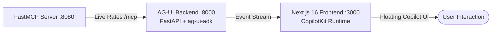

# AG-UI (Agent-User Interaction) - CopilotKit Integration

This directory contains a full-stack implementation of the **AG-UI** protocol, bridging Google ADK autonomous agents with modern React/Next.js frontends via **CopilotKit** and **Gemini 3.5 Flash**.

---

## 🚀 AG-UI: Standardizing Agent Frontends

AG-UI is an open, lightweight, event-based streaming protocol that standardizes how agent backends communicate with agent user interfaces:
- **Interoperability**: Connect any Google ADK agent to diverse frontend frameworks (React, Next.js, etc.).
- **Rich Interaction**: Leverages CopilotKit's pre-built interactive UI components (chat popups, sidebars, inline actions).
- **Tool Transparency**: Tool invocations (e.g. MCP exchange rate lookups) and agent progress are streamed to the user interface in real time.

---

## 🛠️ System Architecture



1. **MCP Server** (`../MCP/server.py`): Serves live exchange rates via FastMCP over streamable HTTP.
2. **AG-UI Backend** (`backend/main.py`):
   - Powered by **FastAPI** and `ag-ui-adk`.
   - Uses **Gemini 3.5 Flash** (configurable via `GEMINI_MODEL`).
   - Exposes the AG-UI event stream on port `8000`.
3. **Next.js Frontend** (`frontend/`):
   - Built with Next.js 16, `@copilotkit/react-core`, and `@copilotkit/react-ui`.
   - Features a floating "Currency Assistant" popup.
   - Forwards queries to the AG-UI backend via the Next.js runtime adapter (`/api/copilotkit`).

---

## 🏁 How to Run

### 1. Start the MCP Server
```bash
cd ../MCP && uv run server.py
# Or from protocols root:
./run.sh mcp
```

### 2. Start the AG-UI Backend
```bash
cd backend
cp .env.example .env  # Configure GEMINI_API_KEY
uv sync
uv run python main.py
# Or from protocols root:
./run.sh agui-backend
```

### 3. Start the Next.js Frontend
```bash
cd frontend
npm install
npm run dev
# Or from protocols root:
./run.sh agui-frontend
```

### 4. Interact
Open `http://localhost:3000` in your browser and click the floating **Currency Assistant** icon (bottom right):
> *"How much is 100 USD in MXN?"*

---

## 📝 Configuration Note

If you modify the agent name in `backend/main.py` (default: `agui_currency_agent`), make sure to update:
1. `src/app/api/copilotkit/route.ts` (agent mapping parameter)
2. `src/app/layout.tsx` (the `agent` prop in the `<CopilotKit>` provider)
