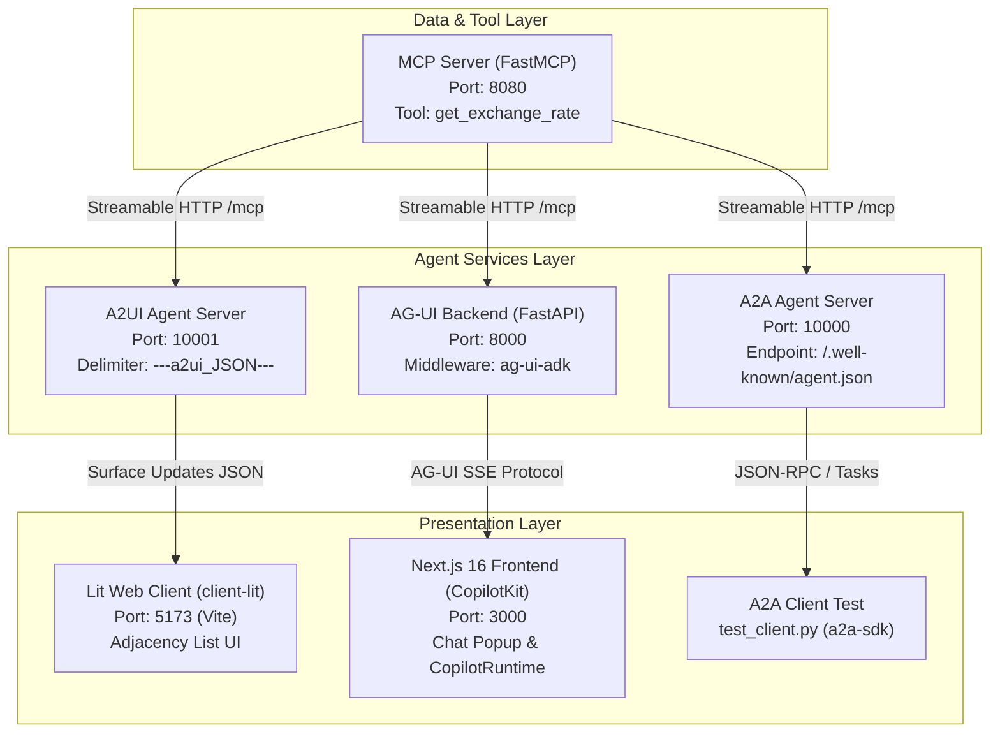

# AI Agent Interoperability Protocols

This directory demonstrates industry-standard protocols for connecting AI agents to external tools, other autonomous agents, and modern frontend user interfaces using **Google ADK (Agent Development Kit)** and **Gemini 3.5 Flash**.

---

## 🏗️ System Architecture



---

## 📂 Protocol Catalog

| Protocol | Directory | Port | Key Technologies | Description |
| :--- | :--- | :--- | :--- | :--- |
| **[MCP](./MCP)** | `protocols/MCP` | `8080` | `FastMCP`, `httpx` | Exposes local/remote tools via Model Context Protocol over streamable HTTP. Provides the `get_exchange_rate` tool. |
| **[A2A](./A2A)** | `protocols/A2A` | `10000` | `google-adk`, `a2a-sdk`, `uvicorn` | Exposes an ADK agent over Agent-to-Agent protocol with discovery card (`/.well-known/agent.json`) and JSON-RPC task endpoints. |
| **[A2UI](./A2UI)** | `protocols/A2UI` | `10001`<br/>`5173` | Backend: ADK + A2A<br/>Frontend: Lit + `@a2ui/lit` v0.9 | Official Agent-to-User Interface Protocol v0.9 (Prompt-First architecture, createSurface, updateComponents, updateDataModel) rendered with `@a2ui/web_core`. |
| **[AG-UI](./AGUI)** | `protocols/AGUI` | `8000`<br/>`3000` | Backend: `ag-ui-adk` + FastAPI<br/>Frontend: Next.js 16 + CopilotKit | Real-time event streaming bridge connecting Google ADK to modern React/Next.js copilot chat interfaces. |

---

## 🚀 Quick Start

### 1. Interactive Runner Shell
Use the provided runner script to launch any service or run tests:

```bash
cd protocols

# Show the interactive menu
./run.sh

# Or start services directly:
./run.sh mcp              # 1. Start MCP Tool Server (port 8080)
./run.sh a2a              # 2. Start A2A Agent Server (port 10000)
./run.sh a2a-test         #    Run A2A client test
./run.sh a2ui-backend     # 3. Start A2UI Agent Server (port 10001)
./run.sh a2ui-frontend    #    Start Lit UI Client (port 5173)
./run.sh agui-backend     # 4. Start AG-UI FastAPI Server (port 8000)
./run.sh agui-frontend    #    Start Next.js Frontend (port 3000)
```

### 2. Diagnostics & Verification
Run the automated self-diagnostic script to test all protocol packages, models, and imports:

```bash
./run.sh verify
```

---

## ⚙️ Environment Configuration

Each protocol submodule includes an `.env.example` file. You can configure:
- **Gemini Developer API** (default): Set `GEMINI_API_KEY=your_key` and `GEMINI_MODEL=gemini-3.5-flash`.
- **Google Cloud Vertex AI**: Set `GOOGLE_GENAI_USE_VERTEXAI=TRUE`, `GOOGLE_CLOUD_PROJECT`, and `GOOGLE_CLOUD_LOCATION`.
